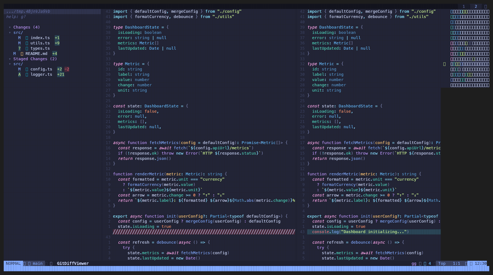
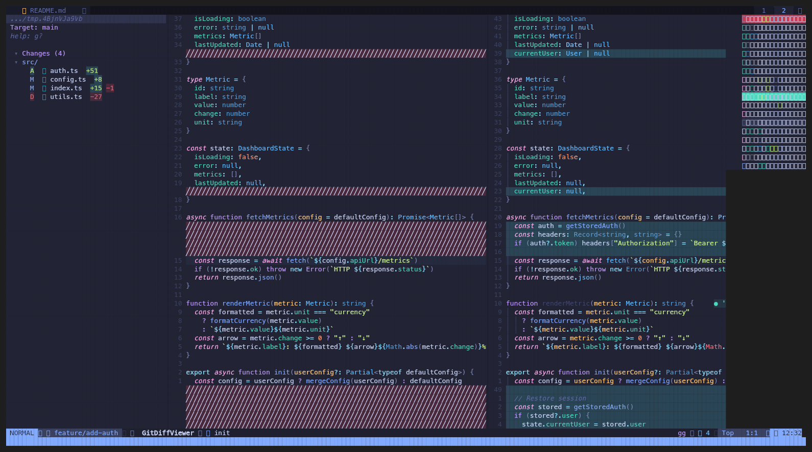
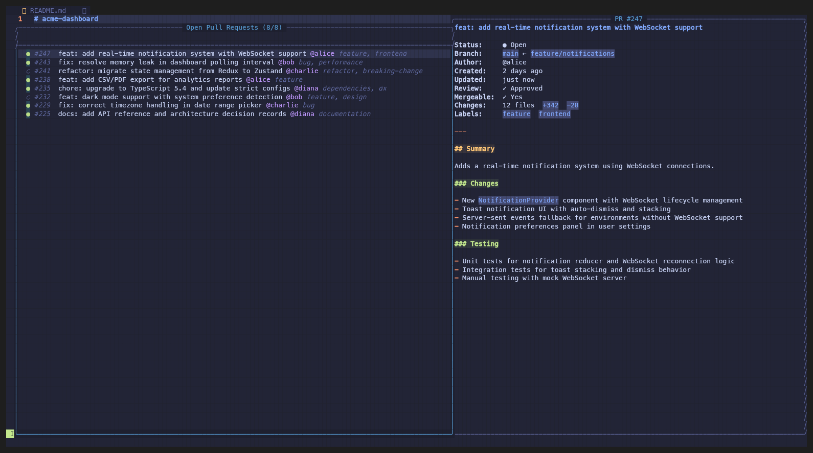

# git-diff-viewer.nvim

A side-by-side git diff viewer for Neovim with staging, branch comparison, and PR browsing.



## Features

- Side-by-side diff view with synchronized scrolling
- Stage, unstage, and discard changes per file or folder
- File tree panel with collapsible folders and status icons
- Branch comparison mode (compare any branch against your working tree)
- PR picker with fuzzy search and preview (via `gh` CLI)
- Fuzzy file finder within changed files
- Viewed diffs history tracker
- Auto-refresh on external git changes (file watcher)
- [mini.icons](https://github.com/echasnovski/mini.icons) support for file type icons

## Requirements

- Neovim >= 0.10
- git
- [gh](https://cli.github.com) CLI (optional, for `:GitDiffViewerPRs`)

## Installation

Using [lazy.nvim](https://github.com/folke/lazy.nvim):

```lua
{
  "lioneltay/git-diff-viewer.nvim",
  cmd = { "GitDiffViewer", "GitDiffViewerClose", "GitDiffViewerBranch", "GitDiffViewerPRs" },
  opts = {},
}
```

## Usage

### Status Mode

```vim
:GitDiffViewer
```

Opens a diff viewer tab showing your working tree changes (staged, unstaged, and untracked files). Select a file in the panel to view its side-by-side diff. Use `s` / `u` / `x` to stage, unstage, or discard changes.

### Branch Mode

```vim
:GitDiffViewerBranch [branch]
```

Compares your current working tree against another branch. If no branch is specified, a branch picker opens. Press `b` in the panel to switch the target branch.



### PR Picker

```vim
:GitDiffViewerPRs
```

Opens a floating picker showing all open pull requests from the current repository. Type to fuzzy search by PR number, title, author, or label. Press `<CR>` to open the selected PR in your browser.

Requires the `gh` CLI to be installed and authenticated.



## Keymaps

### Panel (file list)

| Key | Action |
|-----|--------|
| `<CR>` | Open diff / toggle folder |
| `s` | Stage file or folder |
| `u` | Unstage file or folder |
| `x` | Discard changes |
| `S` | Stage all |
| `U` | Unstage all |
| `R` | Refresh |
| `<Tab>` | Next file |
| `<S-Tab>` | Previous file |
| `gf` | Open file in previous tab |
| `<C-l>` | Focus diff pane |
| `<leader>ff` | Fuzzy find changed files |
| `<leader>fb` | Viewed diffs history |
| `b` | Change target branch (branch mode) |
| `g?` | Show help |
| `q` | Close |

### Diff panes

| Key | Action |
|-----|--------|
| `]c` / `]h` | Next hunk |
| `[c` / `[h` | Previous hunk |
| `gf` | Open file in previous tab |
| `<C-h>` | Focus panel |
| `<leader>ff` | Fuzzy find changed files |
| `<leader>fb` | Viewed diffs history |
| `q` | Close |

## Configuration

Pass options to `setup()` or the `opts` table in lazy.nvim. All fields are optional — defaults shown below:

```lua
require("git-diff-viewer").setup({
  -- Width of the file panel (in columns)
  panel_width = 40,

  -- Keymaps for the file panel buffer
  keymaps = {
    stage = "s",
    unstage = "u",
    discard = "x",
    stage_all = "S",
    unstage_all = "U",
    refresh = "R",
    close = "q",
    open_file = "gf",
    focus_diff = "<C-l>",
    next_file = "<Tab>",
    prev_file = "<S-Tab>",
  },

  -- Keymaps for the diff pane buffers
  diff_keymaps = {
    close = "q",
    open_file = "gf",
    focus_panel = "<C-h>",
  },

  -- Keymaps for branch mode panel
  branch_keymaps = {
    change_branch = "b",
  },
})
```

## Highlight Groups

All highlight groups can be overridden in your colorscheme or config. Defaults:

| Group | Linked To | Purpose |
|-------|-----------|---------|
| `GitDiffViewerSectionHeader` | `Label` | Section headers ("Changes", "Staged Changes") |
| `GitDiffViewerSectionCount` | `Identifier` | Item count in section headers |
| `GitDiffViewerFileName` | `Normal` | File name (inactive) |
| `GitDiffViewerFileNameActive` | `Type` | Currently viewed file name |
| `GitDiffViewerFolderName` | `Directory` | Folder names |
| `GitDiffViewerFolderIcon` | `NonText` | Collapse/expand chevrons |
| `GitDiffViewerStatusM` | `diffChanged` | Modified status icon |
| `GitDiffViewerStatusA` | `diffAdded` | Added status icon |
| `GitDiffViewerStatusD` | `diffRemoved` | Deleted status icon |
| `GitDiffViewerStatusR` | `Type` | Renamed status icon |
| `GitDiffViewerStatusConflict` | `DiagnosticWarn` | Conflict status icon |
| `GitDiffViewerInsertions` | `diffAdded` | Addition counts (+N) |
| `GitDiffViewerDeletions` | `diffRemoved` | Deletion counts (-N) |
| `GitDiffViewerDim` | `Comment` | Dimmed text (labels, metadata) |
| `GitDiffViewerPrNumber` | `Comment` | PR number in picker |
| `GitDiffViewerPrAuthor` | `Label` | PR author in picker |
